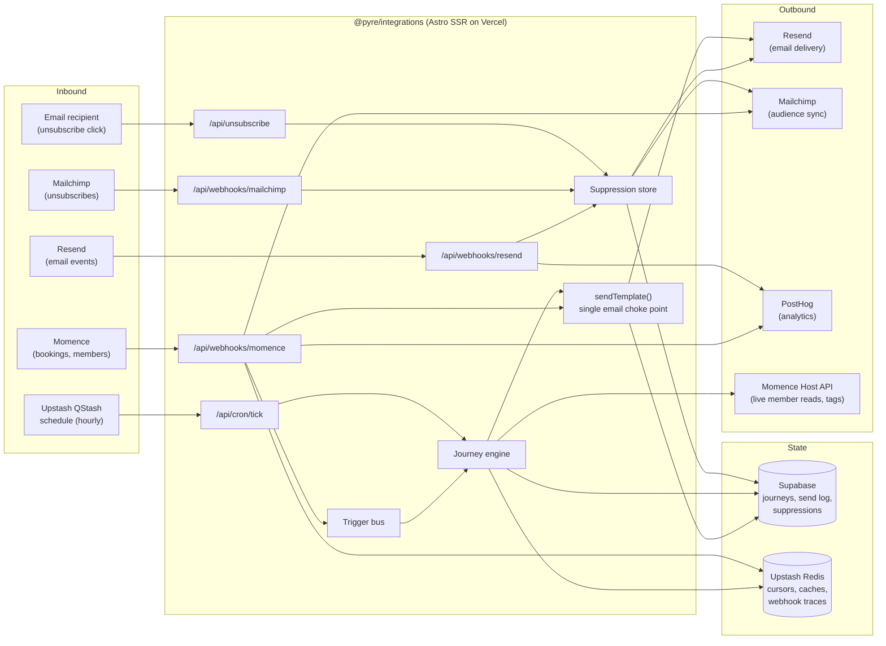
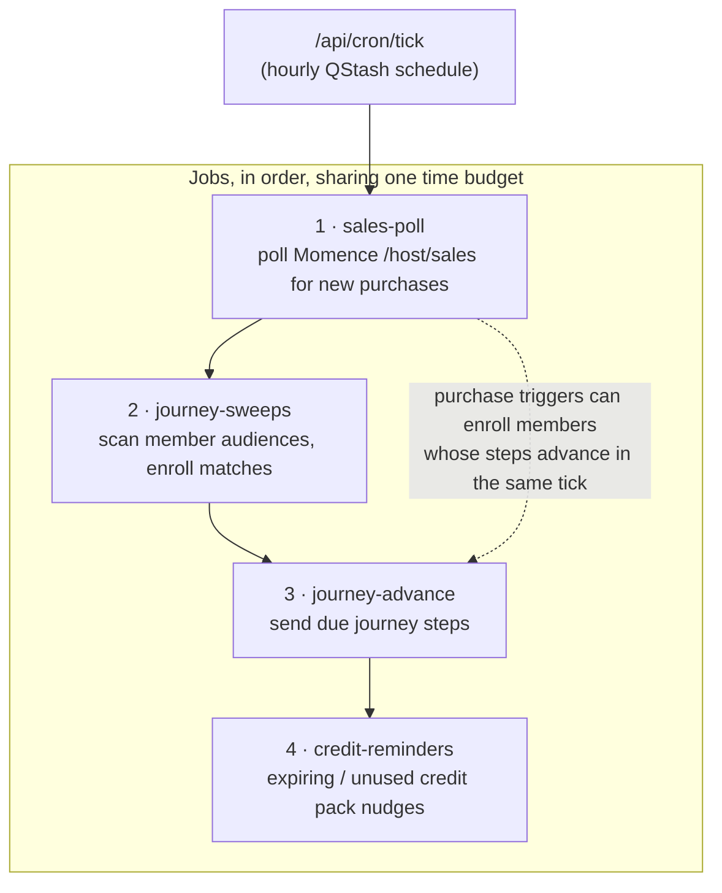
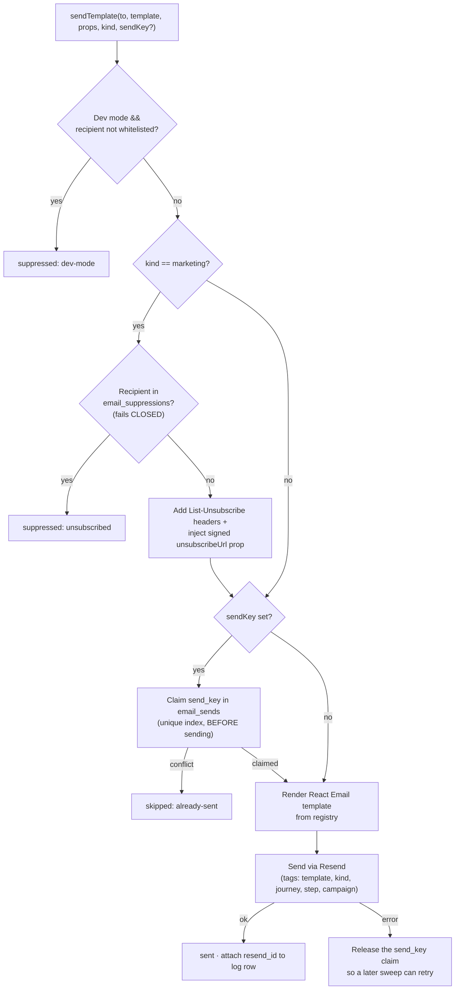
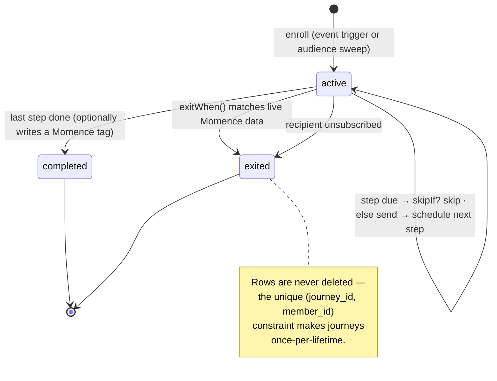
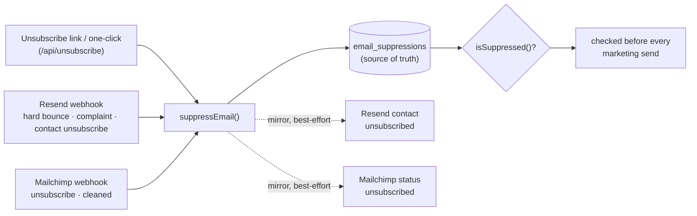

# @pyre/integrations

Dedicated backend service (Astro SSR on Vercel) that connects Momence — the booking
system and source of truth for members, sessions, and purchases — to everything
downstream: transactional and marketing email (Resend), audience sync (Mailchimp),
product analytics (PostHog), and a custom email journey engine.

There is no UI here (aside from a placeholder index page). The entire app is API
routes driven by two kinds of input:

- **Webhooks** — Momence, Resend, and Mailchimp push events to us.
- **A single hourly cron** — polls for what Momence can't push (purchases), sweeps
  member audiences, and advances email journeys.

For step-by-step walkthroughs of how events move through the system, see
**[docs/event-flows.md](docs/event-flows.md)**.

## System overview



Key design decisions:

- **Momence is never mirrored.** Journeys and sweeps read member state live from the
  Momence Host API at decision time. The only durable state we keep is *our own*:
  enrollments, the send log, and suppressions.
- **All email flows through one function.** `sendTemplate()`
  ([src/lib/email/send.ts](src/lib/email/send.ts)) applies the dev-mode whitelist,
  the marketing suppression check, send-key dedupe, unsubscribe headers, and
  template rendering. No call site can bypass compliance.
- **Everything is idempotent.** Webhooks can be retried by Momence, and cron jobs
  re-scan audiences every hour. Redis idempotency keys, `email_sends.send_key`
  unique claims, and the `journey_enrollments` unique constraint make repeats no-ops.
- **Best-effort boundaries.** A Resend or PostHog outage never 500s the Momence
  webhook (which would trigger Momence retries); trigger fan-out never fails its
  producer.

## HTTP surface

| Route | Method | Auth | Purpose |
| --- | --- | --- | --- |
| `/api/webhooks/momence` | POST | Shared secret + optional HMAC signature | Member, address, and booking events from Momence |
| `/api/webhooks/momence-backfill` | POST | `MOMENCE_BACKFILL_SECRET` | Manual bulk sync of Momence members to Mailchimp/Resend |
| `/api/webhooks/resend` | POST | Svix HMAC signature | Email engagement events + bounce/complaint suppression |
| `/api/webhooks/mailchimp` | GET/POST | URL secret param + HMAC signature | Mailchimp unsubscribes/cleans into the suppression store |
| `/api/cron/tick` | GET/POST | `Bearer CRON_SECRET` | Hourly cron entry point (QStash schedule) — runs all registered jobs |
| `/api/unsubscribe` | GET/POST | HMAC-signed token | Footer-link (GET) and RFC 8058 one-click (POST) unsubscribe |
| `/api/partner/request` | POST | `Bearer PARTNER_API_SECRET` | Partner-discount verification intake, relayed server-to-server from the landing page |
| `/api/partner/decision` | GET | HMAC-signed token | One-click partner confirm/deny — tags the member in Momence on confirm |
| `/api/img/[...path]` | GET | none | Caching proxy for Momence session images used in emails |

Every webhook route is wrapped by `instrumentWebhook()`
([src/lib/webhooks/instrument.ts](src/lib/webhooks/instrument.ts)), which records a
full execution trace (event type, per-step spans, duration, errors) to Redis. The
admin dashboard reads those traces for observability.

### Admin dashboard

`/` is the admin sign-in page (Momence OAuth + `ADMIN_EMAILS` allowlist); `/admin`
is the tool directory. Every `/admin/*` page shares `AdminLayout` (server-side
gate + responsive nav) and every `/api/admin/*` route re-checks the session via
`requireAdmin`.

| Route | Purpose |
| --- | --- |
| `/admin` | Tool directory |
| `/admin/email` | Email performance — sends, errors, deliverability, journeys |
| `/admin/email-templates` | Every registered template rendered with editable props |
| `/admin/utm-assist` | Tracked-link builder: UTM links, QR codes, short links, shared campaigns |
| `/admin/webhooks` | Webhook execution log + health stats |
| `/admin/campaigns` | Campaign performance (short-link clicks + PostHog attribution) |

The UTM/webhook/campaign tools were ported from the landing-page admin and read
the same shared Upstash store via `@pyre/webhook-core`. Campaign performance
additionally needs `POSTHOG_PERSONAL_API_KEY` (Query Read scope) and
`POSTHOG_PROJECT_ID` set on this deployment. `PUBLIC_SITE_URL` supplies the
landing-site origin for short links (`/s/<code>` redirects stay on the landing
site), event links, and the blog-posts/events feeds UTM Assist consumes.

## The hourly cron

An Upstash QStash schedule (cron `0 * * * *`) POSTs to `/api/cron/tick` once an
hour, forwarding the auth header via `Upstash-Forward-Authorization: Bearer
$CRON_SECRET`. (Vercel's own crons require the Pro plan; QStash schedules are free
and Upstash is already part of the stack.) The
tick runs every job in [src/lib/cron/jobs.ts](src/lib/cron/jobs.ts) sequentially
inside a shared ~50s time budget. Jobs that run out of time persist a Redis cursor
and resume next tick.



Useful manual invocations:

```bash
# All jobs, report-only (no sends, no state writes)
curl -H "Authorization: Bearer $CRON_SECRET" "https://<integrations>/api/cron/tick?dryRun=1"

# One job
curl -H "Authorization: Bearer $CRON_SECRET" "https://<integrations>/api/cron/tick?job=journey-advance"

# Manually enroll a member into a journey (for whitelist testing)
curl -H "Authorization: Bearer $CRON_SECRET" "https://<integrations>/api/cron/tick?enroll=<memberId>&journey=<journeyId>"
```

## Email system

`sendTemplate()` is the single choke point all email passes through:



- **Transactional** email (booking confirmations, first-timer welcome) always sends;
  short-horizon webhook-retry dedupe lives in Redis
  ([src/lib/email/idempotency.ts](src/lib/email/idempotency.ts)).
- **Marketing** email (journeys, campaigns, reminders) is checked against the
  suppression list, carries one-click unsubscribe headers, and dedupes long-horizon
  via `email_sends.send_key` — claimed *before* the send, so concurrent sweeps can
  never double-fire (at-most-once semantics).

Templates are React Email components registered in
[src/emails/registry.ts](src/emails/registry.ts) (template key → subject builder +
component). The Resend tags attached at send time come back on Resend webhook
events, which lets PostHog attribute opens/clicks to a specific journey step.

### Journeys

The journey engine ([src/lib/email/journeys/engine.ts](src/lib/email/journeys/engine.ts))
runs multi-step, once-per-lifetime email sequences. State is deliberately thin: one
row per journey+member in `journey_enrollments` holding only the current step and
when it's due — everything else (has the member purchased? visited? unsubscribed?)
is re-checked live at send time.



Current journeys ([src/lib/email/journeys/registry.ts](src/lib/email/journeys/registry.ts)):

| Journey | Enrollment | Steps | Exit condition |
| --- | --- | --- | --- |
| `post-intro-offer` | Event: intro-offer purchase, or first-ever booking | Day 3 follow-up → day 10 credit-pack pitch → day 21 membership pitch (skipped if <2 visits) | Member buys anything beyond the intro |
| `review-request` | Sweep: members with 4+ checked-in visits, minus tag exclusions | Single review ask | — (completion writes a `Review Requested` tag back to Momence) |

Repeatable, per-pack sends (credit expiry at 14/3 days, quarterly unused-credit
nudges) are **not** journeys — they're direct sweeps in
[src/lib/email/triggers/credit-reminders.ts](src/lib/email/triggers/credit-reminders.ts)
that dedupe per bought-pack via `send_key`, since a member can buy packs repeatedly.

### Suppression

`email_suppressions` in Supabase is the single source of truth for marketing
consent. Every input funnels into `suppressEmail()`, which records the address and
mirrors the opt-out to Resend and Mailchimp:



The check **fails closed**: if the suppression store is unreachable, every marketing
send is treated as suppressed. Compliance beats reach.

### Partner verification (reciprocal discounts)

Members of partner businesses (BFT Carytown first) get 15% off via a Momence
**customer tag + price rule** — no discount code. The flow: a customer submits the
form on the landing page's partner page → landing page relays to
`/api/partner/request` → we email the partner contact signed one-click
Confirm/Deny links (`/api/partner/decision`) → on confirm, the member is
found-or-created in Momence and tagged, and the price rule applies the discount
automatically at checkout. The `partner-maintenance` cron job expires requests
older than 14 days and emails each partner a quarterly reconciliation list of
tagged members (send_key-gated). Code: `src/lib/partner/`, config in
`src/lib/partner/config.ts`.

Adding a partner requires manual Momence dashboard setup **before** launch:

1. Create the customer tag named in the partner's config (e.g. `partner-bft`) —
   the tag map is Redis-cached for 24h, so create it first.
2. Create a Price Rule keyed on that tag: 15% off single sessions + credit packs.
3. Set the partner's contact-email env var (e.g. `PARTNER_BFT_CONTACT_EMAIL`) and
   add the entry to `PARTNERS` in `src/lib/partner/config.ts`.

Shared env: `PARTNER_API_SECRET` (also set on the landing page along with
`INTEGRATIONS_API_URL`), `PARTNER_LINK_SECRET` (falls back to `CRON_SECRET`),
`PARTNER_CC_EMAIL` (Pyre address CC'd on partner-facing email).

## Data & state

| Store | What lives there |
| --- | --- |
| **Supabase** `journey_enrollments` | One row per journey+member (unique, never deleted): current step, `next_at`, status, exit reason |
| **Supabase** `email_sends` | Append-only send log + long-horizon dedupe via unique `send_key` |
| **Supabase** `email_suppressions` | Marketing suppression source of truth (unique lowercase email, reason, source) |
| **Supabase** `partner_verifications` | Partner-discount verification workflow/audit state (pending → confirmed/denied/expired); the Momence tag itself stays the discount's source of truth |
| **Upstash Redis** | Sweep/sales cursors (`sales:cursor`, `sweep:*:cursor`), webhook-retry idempotency keys, short-TTL Momence caches (member packs, tag map), webhook execution traces (shared with the landing-page admin dashboard) |
| **PostHog** | `booking_completed/cancelled`, `purchase_completed`, `journey_*`, `email_delivered/opened/clicked/bounced/complained` — all keyed by lowercase email as distinct id |

Schema: [apps/supabase/migrations/20260714000000_email_marketing.sql](../supabase/migrations/20260714000000_email_marketing.sql).

## Directory map

```
src/
├── pages/
│   ├── api/
│   │   ├── webhooks/
│   │   │   ├── momence.ts           # member / address / booking events
│   │   │   ├── momence-backfill.ts  # manual bulk member sync
│   │   │   ├── resend.ts            # engagement analytics + bounce/complaint suppression
│   │   │   └── mailchimp.ts         # unsubscribe/cleaned suppression
│   │   ├── cron/tick.ts             # hourly cron entry point
│   │   ├── unsubscribe.ts           # signed unsubscribe link + RFC 8058 one-click
│   │   └── img/[...path].ts         # Momence image proxy for emails
│   └── index.astro
├── emails/
│   ├── registry.ts                  # template key → subject + component
│   ├── templates/                   # React Email templates
│   └── components/                  # shared layout, header/footer, colors, assets
└── lib/
    ├── analytics/                   # PostHog server-side capture
    ├── cron/                        # job registry + cron auth
    ├── email/
    │   ├── send.ts                  # sendTemplate() — the choke point
    │   ├── send-log.ts              # email_sends claims + audit
    │   ├── suppression.ts           # suppression store + outward mirroring
    │   ├── unsubscribe-token.ts     # HMAC-signed unsubscribe links
    │   ├── journeys/                # engine, types, journey definitions
    │   └── triggers/                # booking confirmation, credit reminders, ...
    ├── momence/host-api.ts          # authenticated Momence Host API client
    ├── triggers/
    │   ├── dispatch.ts              # tiny internal event bus (webhook/poller → engine)
    │   └── sales-poll.ts            # purchase discovery via /host/sales polling
    └── webhooks/
        ├── momence.ts               # webhook verification + member API helpers
        └── instrument.ts            # execution tracing for the admin dashboard
```

## Development

```bash
yarn workspace @pyre/integrations dev     # Astro dev server
yarn workspace @pyre/integrations email   # react-email template preview on :3030
```

Safety rails for testing against real data:

- `EMAIL_LIVE_TEMPLATES` — allowlist of templates that send for real
  (comma-separated exact keys and/or `prefix-*` globs, e.g. `partner-*`; `*` =
  everything live). Templates not on the list only reach `EMAIL_DEV_WHITELIST`
  addresses — everyone else is suppressed with a logged reason. Whitelisted
  recipients receive ALL templates, live or not. Unset = everything gated.
- `JOURNEY_FAST_MODE=true` — journey step delays run in minutes instead of hours,
  so a multi-week journey can be walked end-to-end in one sitting.
- `?dryRun=1` on the cron tick — every job reports what it *would* do without
  sending or writing state.

Environment variables are documented inline in [src/env.d.ts](src/env.d.ts).

## Email assets & caching

Transactional emails reference images by absolute URL through the `ASSET_BASE`
constant (`src/emails/components/assets.ts`), which points at this deployment's
`/email/` directory (the files in `public/email/`). Email clients fetch these
through their own image proxies (Gmail, Apple Mail Privacy Protection, etc.).

**Static email assets must be served with long-lived cache headers.** Vercel's
default for `public/` files is `Cache-Control: public, max-age=0, must-revalidate`,
which forces the client/proxy to re-fetch *every image on every open*. Under that
policy any transient hiccup — a serverless cold start, a brief 5xx, a proxy
timeout, or simply the client hitting its parallel-connection limit while loading
several images at once — silently drops an image, so icons and banners "sometimes"
fail to load.

This is configured in `vercel.json` and **must be kept in place**:

```json
"headers": [
  {
    "source": "/email/(.*)",
    "headers": [
      { "key": "Cache-Control", "value": "public, max-age=31536000, immutable" }
    ]
  }
]
```

### Rules when working with email images

- **Keep the `/email/(.*)` cache header** in `vercel.json`. Never let email assets
  fall back to the `max-age=0, must-revalidate` default.
- **Version the URL when you replace an asset.** Because the header is `immutable`,
  proxies/caches keep a swapped-out file under the same name. When you change an
  existing image, either rename it or append a cache-buster (e.g.
  `${ASSET_BASE}/logo-header-creme.png?v=2`) so clients fetch the new bytes.
- **Keep assets small.** Large backgrounds (e.g. multi-MB PNGs) hog the client's
  few parallel connections and make smaller requests (badges/icons) more likely to
  be dropped. Compress aggressively and prefer JPG for photographic backgrounds.

When previewing locally, `ASSET_BASE` still points at the Vercel production URL, so
newly added/changed images won't appear until deployed. To preview them locally,
set `PUBLIC_EMAIL_ASSET_BASE` to a locally-served `/email` path (e.g.
`http://localhost:4321/email`).
