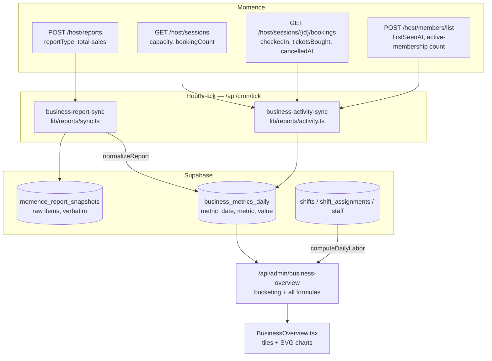

# Business overview: metric sources and calculations

Every number rendered on **`/admin/business`**, traced back to the row it came
from and the arithmetic applied on the way. Written for the moment someone asks
"where does that figure come from?" — for the architecture, see the
[README](../README.md); for how events move through the service, see
[event-flows.md](event-flows.md).

- [1. The short version](#1-the-short-version)
- [2. Where the data comes from](#2-where-the-data-comes-from)
- [3. Storage: the two tables the page reads](#3-storage-the-two-tables-the-page-reads)
- [4. How the raw metrics are produced](#4-how-the-raw-metrics-are-produced)
- [5. Labor cost and open hours](#5-labor-cost-and-open-hours)
- [6. Read-time aggregation](#6-read-time-aggregation)
- [7. Every rendered number, one by one](#7-every-rendered-number-one-by-one)
- [8. Time, calendars, and period boundaries](#8-time-calendars-and-period-boundaries)
- [9. Freshness: last synced and next sync](#9-freshness-last-synced-and-next-sync)
- [10. Known caveats](#10-known-caveats)

---

## 1. The short version

The dashboard renders **nothing it computes itself**. Every value arrives
pre-computed from one admin-only endpoint:

| Layer | File |
| --- | --- |
| Page shell (admin gate) | `src/pages/admin/business.astro` |
| Rendering island (charts, tiles, formatting) | `src/components/admin/BusinessOverview.tsx` |
| **All arithmetic** | `src/pages/api/admin/business-overview.ts` |
| Labor math | `src/lib/schedule/labor.ts` + `@pyre/schedule-core` |
| Momence revenue ingestion | `src/lib/reports/sync.ts` → `src/lib/reports/normalize.ts` |
| Momence activity ingestion | `src/lib/reports/activity.ts` |
| Sync-schedule math (last/next sync) | `src/lib/reports/schedule.ts` |

Two independent inputs are joined at read time:

1. **Momence-sourced metrics** — revenue, attendance, no-shows, occupancy,
   memberships — read out of `business_metrics_daily`, which two daily cron
   jobs keep fresh. Momence is **never** called on the page's request path.
2. **Labor cost and open hours** — computed live, on every request, from the
   `shifts` / `shift_assignments` / `staff` tables.

## 2. Where the data comes from



Both cron jobs are registered in `src/lib/cron/jobs.ts` and run off the single
hourly QStash tick (`src/pages/api/cron/tick.ts`). Each self-gates to **once a
day, first tick at or after 06:00 ET**, and each pulls a **trailing 12-week
window** that upserts in place — so late refunds, cancellations, and corrected
check-ins self-heal on the next day's run without any incremental bookkeeping.

Historical fills use `/api/cron/business-backfill?weeks=N` (same machinery,
caller-chosen window, separate Redis cursor namespace).

## 3. Storage: the two tables the page reads

`apps/supabase/migrations/20260821180001_business_metrics_daily.sql`

**`business_metrics_daily`** — primary key `(metric_date, metric)`, so there is
exactly one value per ET calendar day per metric key, and every sync is an
idempotent upsert.

| `metric` key | Kind | Written by | Meaning |
| --- | --- | --- | --- |
| `revenue_total` | flow (sums) | `lib/reports/normalize.ts` | Net collected dollars |
| `attendance` | flow | `lib/reports/activity.ts` | Seats checked in |
| `no_shows` | flow | `lib/reports/activity.ts` | Booked seats never checked in |
| `session_capacity` | flow | `lib/reports/activity.ts` | Occupancy **denominator** |
| `session_booked` | flow | `lib/reports/activity.ts` | Occupancy **numerator** |
| `new_members` | flow | `lib/reports/activity.ts` | First-seen members that day |
| `active_members` | **stock** | `lib/reports/activity.ts` | Count with an active membership, as of that day |

Occupancy is deliberately stored as its two raw components rather than a
percentage: grouping by week or month then computes the true
`Σbooked / Σcapacity` ratio instead of averaging daily percentages.

**`momence_report_snapshots`** — the raw `total-sales` items, verbatim, one row
per `(report_type, snapshot_date)`. The dashboard reads it only for the
freshness banner (§9); its real job is letting normalization be re-run without
re-spending Momence's 100-report-runs/day budget.

> `business_metrics_weekly` (from the earlier migration
> `20260818090000_business_metrics.sql`) still exists but is neither written nor
> read any more. Only its `active_members` history was carried forward.

## 4. How the raw metrics are produced

### 4.1 `revenue_total`

`src/lib/reports/sync.ts` → `src/lib/reports/normalize.ts`

Momence's report API accepts exactly one usable report type: `total-sales`
(`src/lib/momence/reports.ts` — every other name 400s). One row comes back per
payment transaction.

Per row (`normalize.ts:124` `netRevenue`):

```
if paymentStatus is present and != 'succeeded'  → excluded (not revenue)
net = paymentValue − (refunded ?? 0)
```

Refunds are folded back into the original transaction row rather than arriving
as separate negative rows, so the subtraction is the whole refund handling.

Per day:

```
revenue_total[day] = round2( Σ net over rows whose paymentDate falls on that ET day )
```

`paymentDate` is a **UTC instant**, converted with `utcToEastern()` before
bucketing — slicing the string would push every sale after 8pm ET into the next
day. Rows that can't be parsed at all are counted into the snapshot's
`normalize_status` (`parse-partial`) but never throw and never contribute.

### 4.2 `attendance`, `no_shows`, `session_capacity`, `session_booked`

`src/lib/reports/activity.ts` (`scanWeek`, lines ~270–325). No report exists for
these, so they are swept out of the host endpoints one ET week at a time,
newest first, persisting each whole week as it lands.

For every non-draft, non-cancelled session in the week:

| Guard | Effect |
| --- | --- |
| `startsAt > now` | Skipped entirely — an unstarted session has no occupancy to report, and counting it would drag the in-progress day toward 0%. |
| session hasn't ended (`endsAt > now`) | Capacity/booked counted; **attendance is not** — it hasn't settled. |
| `bookingCount == 0` | No bookings request spent. |

```
session_capacity[day] = Σ session.capacity      (over started sessions)
session_booked[day]   = Σ session.bookingCount  (over started sessions)
```

Then, per booking on each **ended** session:

```
skip if booking.cancelledAt is set
seats = booking.ticketsBought ?? 1
checkedIn → attendance[day] += seats
else      → no_shows[day]   += seats
```

Attendance and no-shows are written for a day **only if at least one session
finished that day** — otherwise a merely young day would read as a day nobody
attended. Capacity/booked are written only when capacity > 0.

Weeks are re-scanned daily for the current week plus the last 2 completed ones
(`REFRESH_WEEKS`); older weeks are considered settled and are re-scanned only
if their rows are missing.

### 4.3 `new_members` and `active_members`

`src/lib/reports/activity.ts` → `collectMemberMetrics` (lines ~340–372).

```
new_members[day] = count of members whose firstSeenAt converts to that ET day
```

Members are paged newest-first (`sortBy: firstSeenAt, DESC`, 100/page, cap 20
pages) until one predates the window. Every day from the window start through
today is **zero-filled**, so a quiet day reads as `0`, not as missing data.

```
active_members[today] = totalCount from POST /host/members/list
                        with filterPreset = 'with-active-membership'
```

This is a **stock**, not a flow: Momence exposes only the count *right now*, so
one observation lands on today's date each sync and history accrues going
forward. It cannot be backfilled.

> Membership **cancellations** are not collected — no host endpoint exposes
> them. The membership chart shows arrivals only rather than an always-empty
> half.

## 5. Labor cost and open hours

`src/lib/schedule/labor.ts` → `computeDailyLabor(db, start, end)`, run **live on
every request**. Nothing about labor is cached or synced.

**Inputs.** `staff` (all rows), `shifts` where `is_draft = false` in range, and
their `shift_assignments` where `is_draft = false`.

**Cost.** `rollupHours()` (`packages/schedule-core/src/hours.ts:47`) buckets
assignments by shift date and staff id, counting only assignments whose shift is
`status = 'active'`. Hours come from the assignment's own window:

```
hours = (timeToMinutes(ends_at) − timeToMinutes(starts_at)) / 60
```

`amountsDue()` (`hours.ts:119`) then prices them:

```
cost[day] = Σ over staff of round2( hours[staff] × staff.pay_rate )
```

Founder hours are priced the same way as anyone else's — the founder exclusion
in `DailyLabor` applies to `paidHours` (a field this endpoint doesn't use), not
to `cost`. In practice founders cost nothing because
`20260817120000_staff_pay_rate.sql` set their rate to 0; that was a one-time
backfill, though, and the column default for new rows is 20, so a newly added
founder would start contributing cost until their rate is set.

`pay_rate` is nullable in the *type* only as a redaction marker for non-admin API
responses; this path uses the service-role client, so every rate is real. That,
plus revenue sitting beside it, is why the whole page is admin-only.

**Open hours.** `openHoursByDay()`
(`packages/schedule-core/src/insights.ts:129`) — the denominator for both unit
economics lines:

```
per shift, only if status == 'active' AND source == 'momence':
  open = max(0, shiftHours − (leadMin + closeMin) / 60)
       = max(0, shiftHours − 2.0)          // 90min setup + 30min shutdown
openHours[day] = Σ open, rounded to 1 decimal
```

Two deliberate choices here:

- **Only Momence-synced shifts count.** All sessions live in Momence; manual
  shifts are maintenance and other non-revenue work. Their labor still lands in
  the cost numerator — where it belongs — but they add no open hours.
- **Not multiplied by `staff_needed`.** This measures hours during which
  customers can be paying, not demanded staff-hours.

Days with no shifts are **omitted**, not zero-filled; the API treats a missing
day as `cost 0, openHours 0` when summing.

## 6. Read-time aggregation

`src/pages/api/admin/business-overview.ts`

**Query params:** `start`, `end` (`YYYY-MM-DD`), `group` (`day` | `week` |
`month`). Guards: `end >= start`; span ≤ 400/800/1600 days by grain; `end` ≤
366 days ahead. Default with no range: the last 8 completed weeks plus the
in-progress one.

Rows are fetched **once** for `prevStart..end` and indexed into
`byDate: Map<date, Map<metric, value>>`. Every rendered figure is then a call to
`totalsOver(from, to)` (line 219), which walks day by day:

```
revenue      = Σ revenue_total    over days that HAVE the row, else null
attendance   = Σ attendance       over days that HAVE the row, else null
noShows      = Σ no_shows         over days that HAVE the row, else null
newMembers   = Σ new_members      over days that HAVE the row, else null
capacity     = Σ session_capacity (missing days treated as 0)
booked       = Σ session_booked   (missing days treated as 0)
laborCost    = round2( Σ computeDailyLabor cost )
openHours    = round1( Σ computeDailyLabor openHours )
```

The `null`-if-absent rule is load-bearing: a period with **no Momence data at
all** renders as `—` / a gap in the chart, never as a `$0` that would read like a
day with no sales. Only `session_capacity` / `session_booked` default to 0,
because their guard is `capacity > 0`.

Derived values, all `round2` (`round2(n) = Math.round(n * 100) / 100`):

| Field | Formula | Null when |
| --- | --- | --- |
| `revenuePerOpenHour` | `revenue / openHours` | no revenue data, or `openHours == 0` |
| `costPerOpenHour` | `laborCost / openHours` | `openHours == 0` |
| `laborPctOfRevenue` | `laborCost / revenue × 100` | no revenue data, or `revenue == 0` |
| `occupancyPct` | `booked / capacity × 100` | `capacity == 0` |
| `activeMembers` | last `active_members` observation at or before the period end | no observation in the fetched window |

**Buckets.** The range is tiled by grain (`periodStartOf` / `nextPeriodStart`),
each bucket being one `totalsOver()` call. Edge buckets are clipped — a quarter
grouped by week starts mid-week — and a bucket is flagged `future: true` when
`bucketEnd >= today`, which is what dims it in the UI and draws the dashed
"in progress" divider.

## 7. Every rendered number, one by one

### 7.1 KPI tiles

All five cover `start .. min(end, today)` — clamped at today so a forward-looking
range never counts scheduled labor against revenue that hasn't happened yet.

| Tile | Value | Sub-line |
| --- | --- | --- |
| **Revenue** | `summary.range.revenue` — Σ `revenue_total` | `+N% vs prior`, else the date range |
| **Revenue / open hour** | `revenue / openHours` | `vs $X labor break-even` = `laborCost / openHours` |
| **Labor % of revenue** | `laborCost / revenue × 100` | `$X labor cost` = raw `laborCost` |
| **Active members** | last `active_members` at or before the range end | `+N% vs prior` |
| **Visits** | Σ `attendance` | `N% occupancy` = `Σbooked / Σcapacity × 100` |

**The delta.** `periodDelta()` in `BusinessOverview.tsx`:

```
pct = round( (current − previous) / previous × 100 )
```

`previous` is the **equal-length period immediately before the range**:
`prevEnd = start − 1 day`, `prevStart = start − (elapsed days in range)`. So a
range clamped to 5 elapsed days compares against the 5 days before it, not the
full selected span. The delta is suppressed when either side is `null` or the
prior period is `0`. Only Revenue and Active members show one.

### 7.2 Revenue vs labor cost (bar chart)

- Gold bar = `bucket.revenue`; narrower creme bar = `bucket.laborCost`.
- Y axis is scaled to `max(revenue, laborCost)` across buckets, floored at 1.
- Tooltip adds `laborPctOfRevenue`.
- A **missing gold bar** means `revenue === null` — no Momence data covers that
  bucket. A **dimmed** bar means `future: true`, i.e. partial.

### 7.3 Per open hour: revenue vs labor break-even (line chart)

- Gold line = `revenuePerOpenHour`; dashed creme line = `costPerOpenHour`.
- Null buckets are rendered as **gaps** — the polyline is split into segments at
  each null so a missing bucket never draws a line down through zero.
- Gold above dashed = the customer-facing hours pay for the labor staffing them.

### 7.4 Memberships (bar chart)

Gold bars = `bucket.newMembers` (Σ `new_members`). Tooltip appends
`bucket.activeMembers`, which is the latest stock observation at or before the
bucket's end — **not** a sum.

### 7.5 Attendance (bar chart)

Gold bars = `bucket.attendance` (seats checked in); the thin creme overlay =
`bucket.noShows`. Occupancy appears in the tooltip only. Note that the two bars
are drawn on the same axis but are **not** a stacked total — a booked seat is
counted in exactly one of them, and both exclude cancelled bookings.

## 8. Time, calendars, and period boundaries

- **Every date is an ET wall-clock calendar day.** Momence timestamps are UTC
  instants and are converted with `utcToEastern()` at ingestion, never sliced.
- **Weeks are Monday-start** (`weekStartOf()`), matching the schedule tables.
- **Months are ET calendar months.**
- The browser computes `today` with `utcToEastern()` too, so a laptop in another
  timezone gets the same preset boundaries as the server.
- Preset ranges (`presetRange()` in `BusinessOverview.tsx`) each open at the
  grain they read best at — quarters at week grain, YTD at month — and the
  Group-by buttons override afterwards.

## 9. Freshness: last synced and next sync

The line under the range controls answers "how current is this?" without anyone
having to open the cron logs:

> Momence data synced **3h ago** · next sync **in 21h** · labor cost is live from
> the schedule

It renders from `payload.sync` (`SyncStatus`), and hovering the first item breaks
the timestamp out per feed.

| Field | Source | Meaning |
| --- | --- | --- |
| `reportsSyncedAt` | newest `momence_report_snapshots.created_at` | when revenue last landed |
| `activitySyncedAt` | newest `business_metrics_daily.updated_at` where `source_report_type = 'HOST_API'` | when attendance / occupancy / members last landed |
| `lastSyncedAt` | the **older** of the two above | the page's freshness floor — it is only as current as its stalest feed |
| `nextSyncAt` | derived, see below | the soonest either job runs again |
| `stale` | `lastSyncedAt` missing or older than `SYNC_STALE_HOURS` (26) | drives the warning banner |
| `missingReportTypes` | `DAILY_REPORTS` minus types seen in the last 3 days | non-empty means revenue ingestion is failing |

Both freshness reads are **unbounded by date**: a sync that died a week ago has
to report as a week old, not as "never run".

When one feed has never synced at all, `lastSyncedAt` falls back to the other
rather than reading "never" — the missing feed's metrics are already visibly
absent from the charts, and `missingReportTypes` names it.

### Deriving `nextSyncAt`

`src/lib/reports/schedule.ts` — no Redis read on the request path. Both jobs
gate identically (first hourly tick at or after `SYNC_HOUR_ET` = 06:00 ET, one
run per ET day), so the next run follows from the clock plus the job's last
write:

```
wrote today already   → tomorrow 06:00 ET      (the done-key holds until then)
now < 06:00 ET        → today 06:00 ET         (gate still shut)
otherwise             → the next top-of-hour tick
```

`nextSyncAt` is the **earlier** of the two jobs' answers, so reports finishing
for the day can't hide an activity sweep still due within the hour.

One deliberate approximation, always in the safe direction: a job that wrote
today and then ran out of tick budget resumes from its Redis cursor on the very
next tick, which this reports as tomorrow morning. It errs late, never early —
promising a refresh that isn't coming would be the worse failure.

**Labor cost and open hours have no sync time** because they are computed from
the shifts tables on the request itself. That is why the line says so
explicitly: without it, "synced 3h ago" reads as if the whole page were 3h old.

## 10. Known caveats

1. **`active_members` has no history.** It is sampled at sync time and cannot be
   backfilled, so buckets before the first sync show `—`. Its "delta vs prior"
   compares two point-in-time samples, not two sums.
2. **Membership cancellations and churn are not available.** No Momence endpoint
   exposes them.
3. **Labor cost is computed from the schedule, not from payroll.** It prices
   *assigned* shift windows at each person's `pay_rate` — no overtime multiplier,
   no taxes or burden, no clock-in/clock-out reconciliation. Founders are priced
   at their stored rate of 0.
4. **Open hours exclude manual shifts entirely**, while their labor cost is
   included. That is intentional (maintenance work is not sellable time) but it
   means a maintenance-heavy period will show a worse `costPerOpenHour`.
5. **Attendance lags within the current day.** A day's row appears only once a
   session has finished, so today's bar climbs through the day.
6. **Revenue is booked on the payment date, not the service date.** A gift card
   or package sold in March and redeemed in May is March revenue, while the May
   visit shows up in attendance — the two series are not expected to move
   together.
7. **Revenue counts `paymentValue − refunded` on succeeded rows only.** It is net
   collected cash, not accrual revenue, and it is not reconciled against
   QuickBooks anywhere in this codebase.
8. **A stalled activity sweep is now visible** in the freshness line and banner
   (§9), but its symptom is still missing attendance/membership bars rather
   than an error — the revenue half of the page keeps working normally.
9. **`null` and `0` mean different things** throughout the payload: `null` is "no
   data covers this period", `0` is a real measured zero. The UI honors the
   distinction (`—` and chart gaps vs. a zero-height bar).
10. **The 12-week trailing sync window is the self-healing horizon.** A refund or
   corrected check-in older than ~12 weeks will never be picked up by the daily
   jobs; it needs a manual `business-backfill` run.
