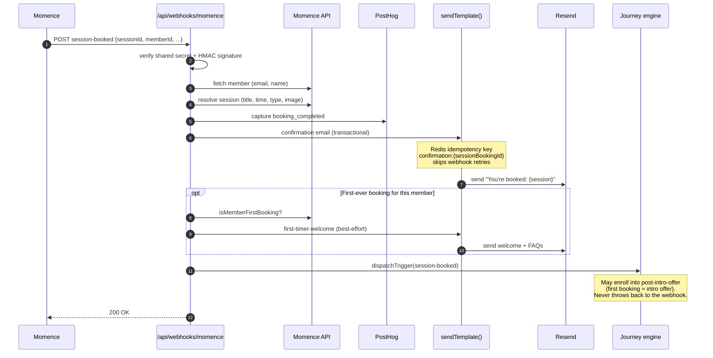
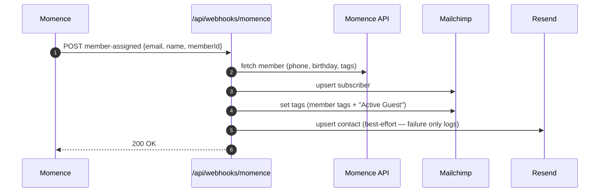
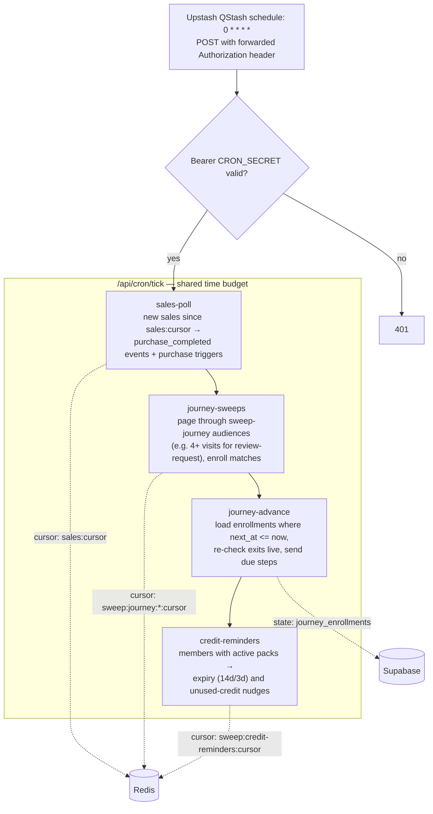
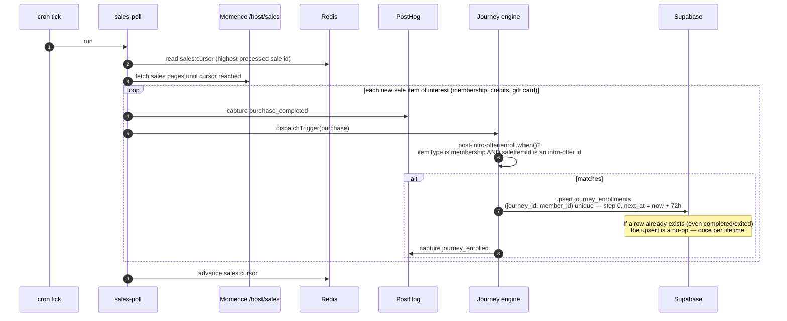
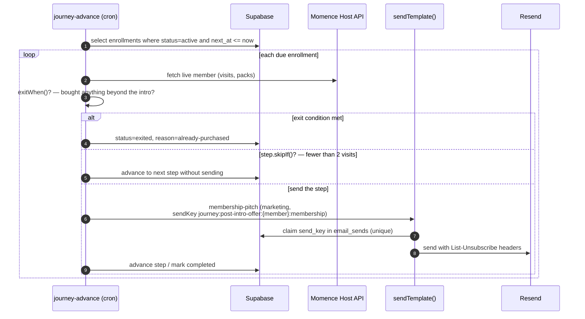
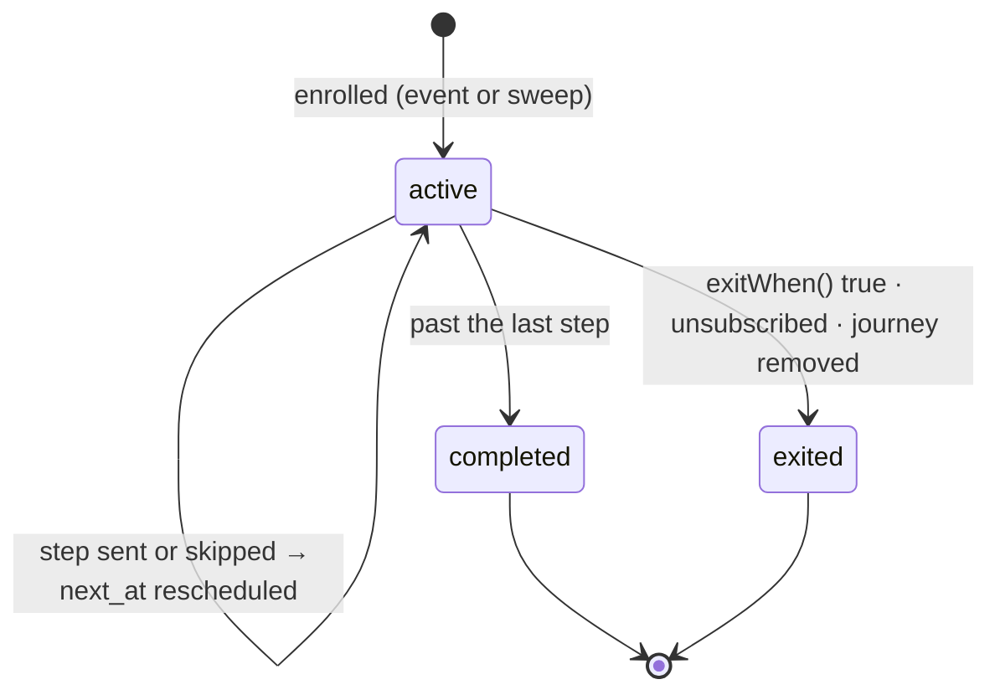
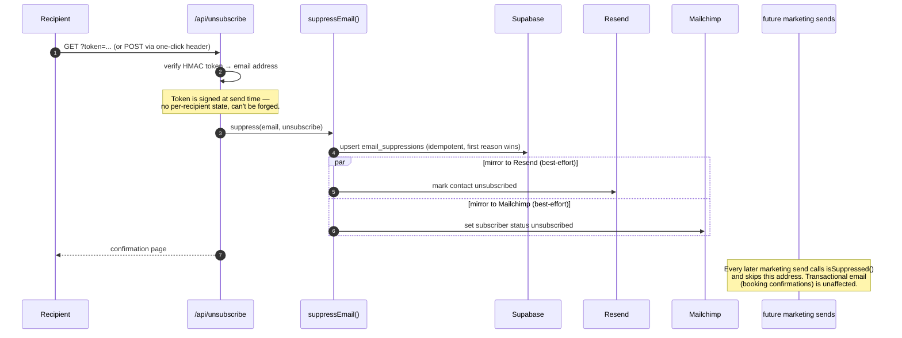
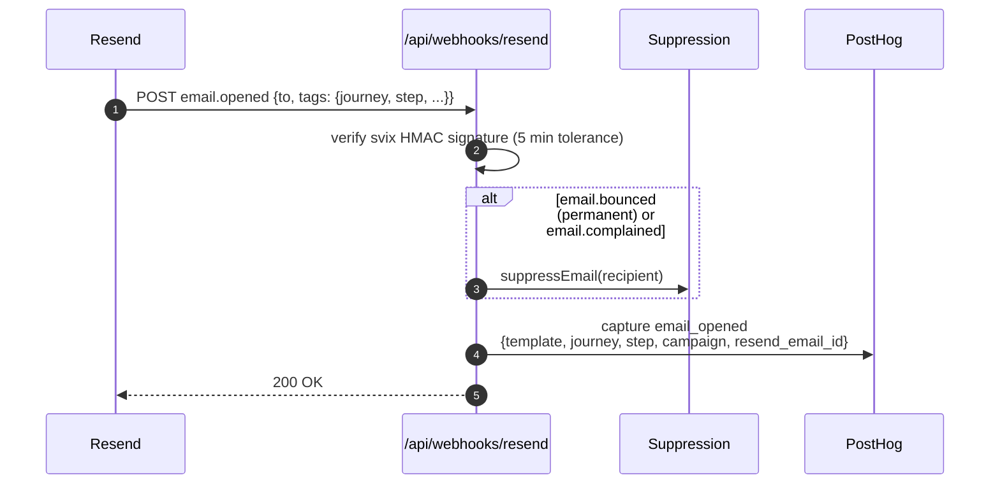

# Event flows

Worked examples of how events move through `@pyre/integrations`, from the moment
something happens in the outside world to every side effect it produces. For the
high-level architecture, see the [README](../README.md).

- [1. A guest books a session](#1-a-guest-books-a-session)
- [2. A new member is created in Momence](#2-a-new-member-is-created-in-momence)
- [3. The hourly cron tick](#3-the-hourly-cron-tick)
- [4. A purchase enrolls someone in a journey](#4-a-purchase-enrolls-someone-in-a-journey)
- [5. A journey step comes due](#5-a-journey-step-comes-due)
- [6. Someone unsubscribes (any channel)](#6-someone-unsubscribes-any-channel)
- [7. Email engagement flows back as analytics](#7-email-engagement-flows-back-as-analytics)

---

## 1. A guest books a session

Momence fires `session-booked` at `/api/webhooks/momence`. One webhook produces a
confirmation email, possibly a first-timer welcome, an analytics event, and a
journey trigger — each behind its own idempotency guard so Momence retries are
harmless.

A `session-booking-cancelled` event takes a much shorter path: it only captures a
`booking_cancelled` PostHog event (best-effort — cancellation emails are
intentionally out of scope).

## 2. A new member is created in Momence

`member-assigned` / `member-updated` events keep the marketing audiences in sync.
Mailchimp is the primary sync target; Resend contacts are best-effort.

Address events (`member-address-created/updated/deleted`) follow the same shape but
only update or clear the Mailchimp address field. The manual backfill endpoint
(`/api/webhooks/momence-backfill`) walks the full member list and runs this same
sync per member, for bootstrapping or repair.

## 3. The hourly cron tick

Everything Momence can't push to us is pulled on an hourly tick. Four jobs run
sequentially inside one ~50-second budget; any job that runs out of time saves a
Redis cursor and resumes on the next tick.

The order matters: `sales-poll` runs first because a purchase it discovers can
enroll a member whose first step then advances later in the very same tick.

## 4. A purchase enrolls someone in a journey

Momence has no purchase webhook, so purchases are discovered by polling. Example:
someone buys the intro offer, which enrolls them in the `post-intro-offer` journey.

On its very first run the poller **baselines** the cursor at the newest sale rather
than replaying history — journeys react to purchases from now on, not to every old
customer at once.

## 5. A journey step comes due

Enrollment rows store only `(step, next_at)`. Everything else — did they buy a
membership? have they visited? did they unsubscribe? — is re-checked live at send
time. Example: the `post-intro-offer` membership pitch on day ~21.

The full lifecycle of an enrollment:

If a send throws, the enrollment row is left untouched and the send-key claim is
released — the next hourly tick simply retries, and the dedupe makes that safe.

## 6. Someone unsubscribes (any channel)

All opt-out signals converge on the `email_suppressions` table, then fan back out
so every sending channel stops. Example: a recipient clicks the footer link in a
journey email.

The same `suppressEmail()` path is fed by two other inputs:

| Source | Trigger | Reason recorded |
| --- | --- | --- |
| Resend webhook | hard bounce / spam complaint / contact unsubscribed | `bounce` / `complaint` / `unsubscribe` |
| Mailchimp webhook | audience unsubscribe / cleaned (hard bounces) | `unsubscribe` / `bounce` |

A journey enrollment whose recipient turns out to be suppressed exits with reason
`unsubscribed` the next time a step comes due.

## 7. Email engagement flows back as analytics

Every send attaches Resend tags (`template`, `kind`, `journey`, `step`,
`campaign`). Resend's webhooks echo those tags back, so engagement lands in PostHog
already attributed to the exact journey step that sent it — using the recipient's
email as the distinct id, the same key as `booking_completed`.

This closes the loop: `journey_enrolled` → `journey_email_sent` →
`email_delivered/opened/clicked` → (ideally) `purchase_completed`, all stitched by
email in PostHog.
