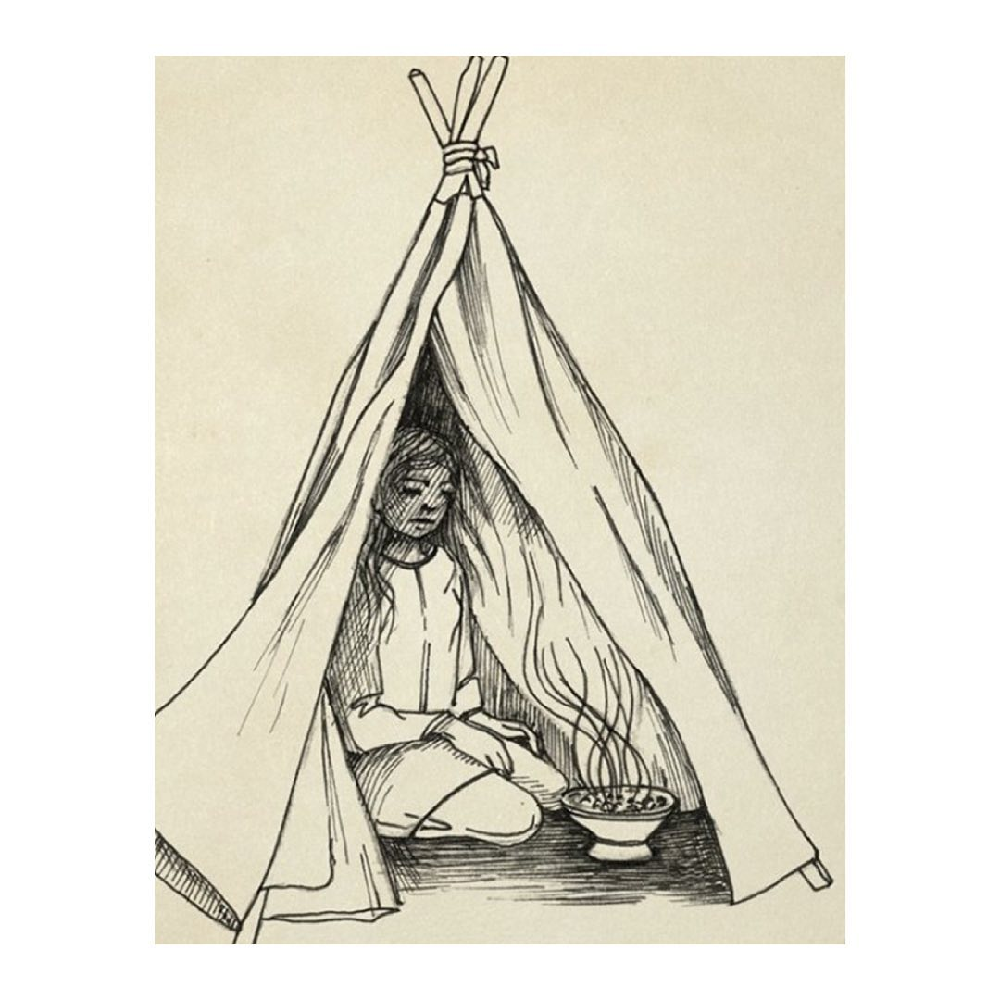
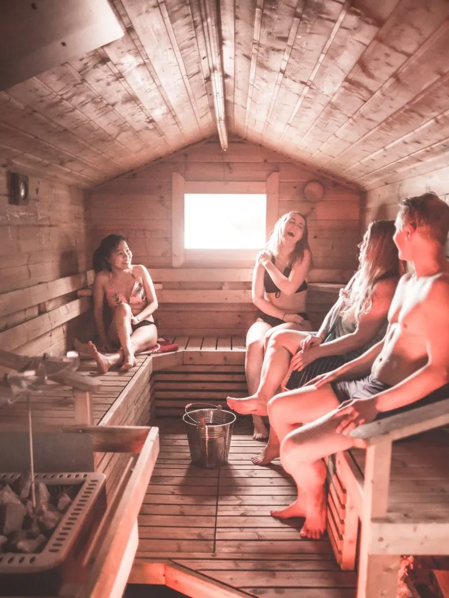
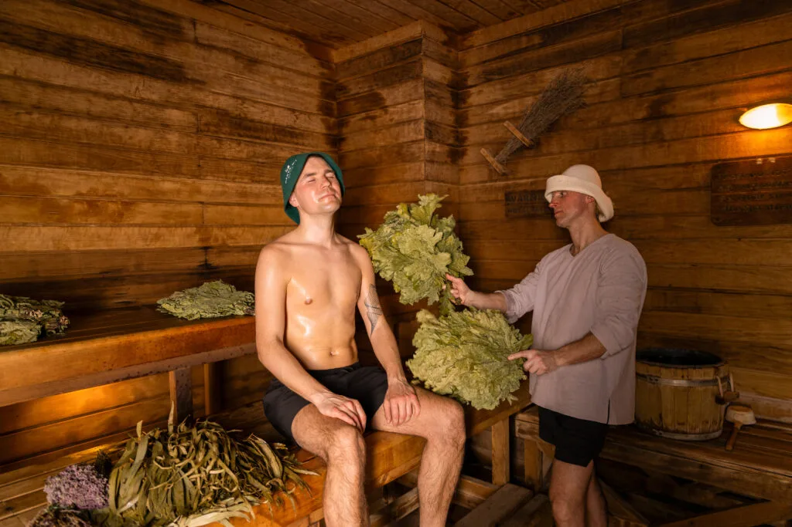
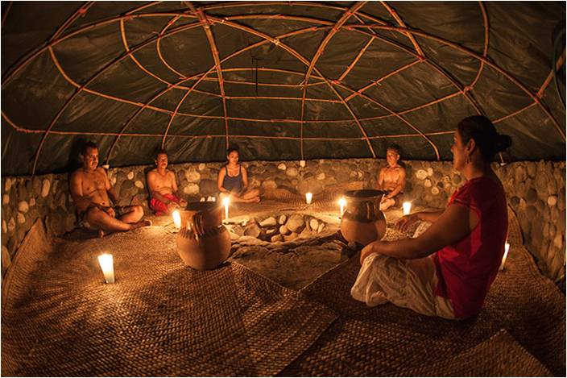
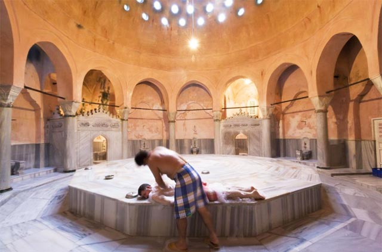
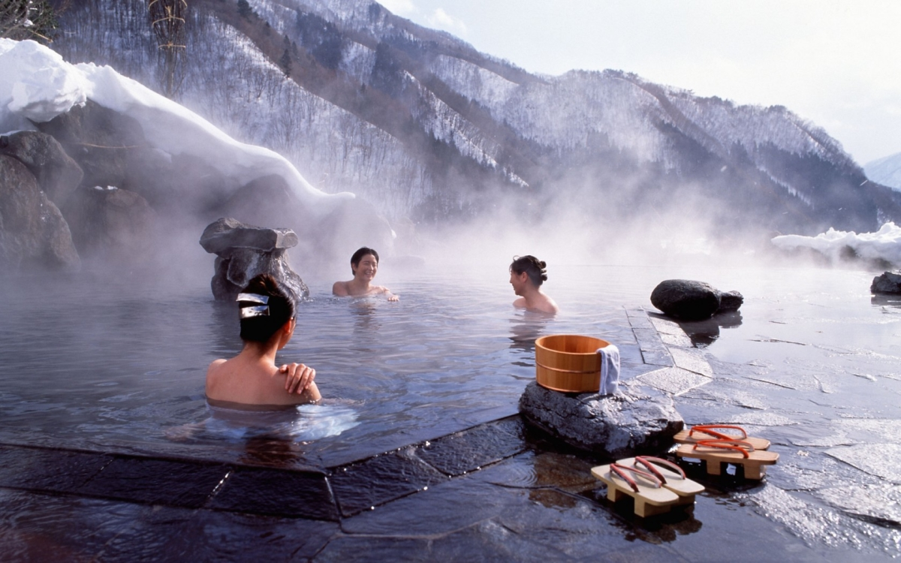
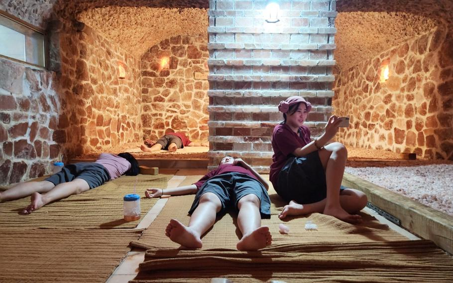
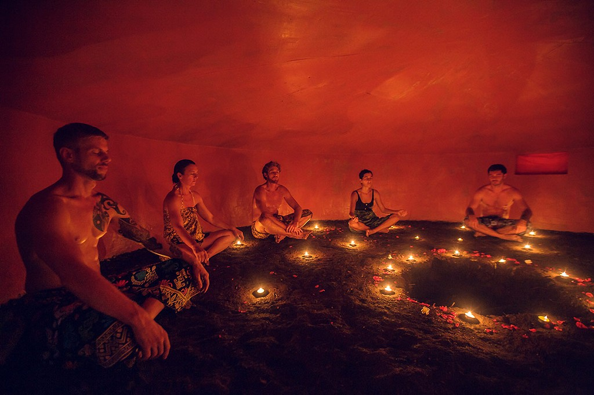

import BlogCTA from '@/components/blog/BlogCTA.astro';

Long before modern wellness centers and spa culture, humans across the globe discovered the benefits of communal sweat bathing. These traditions, developed independently across continents and cultures, share a common thread: the recognition that exposure to heat can cleanse the body, calm the mind, and strengthen community bonds.

## Ancient Origins: The Scythian Sweat Tent

One of the earliest documented accounts of sweat bathing comes from the ancient Greek historian Herodotus in the 5th century BCE, who described the practices of the Scythians — nomadic warriors of the Eurasian steppes.

The Scythians constructed portable sweat tents by setting up three wooden poles and stretching woolen felts around them. Inside, they placed a basin filled with red-hot stones. But their practice had a distinctive feature: they would scatter hemp seeds on the heated stones, creating aromatic vapor that Herodotus claimed made the Scythians "howl with pleasure."

This system served multiple purposes for the nomadic people. The portable nature of the sweat tent matched their lifestyle. The intense heat and vapor provided cleansing and comfort in harsh climates where permanent structures were impossible. The practice also held ceremonial significance — Herodotus noted that Scythians used these vapor baths as purification rituals, particularly after handling the dead.

The Scythian tradition represents perhaps humanity's earliest recorded evidence of intentional sweat bathing as a cultural practice — a testament to how deeply this wisdom runs in our collective human heritage.

## The Finnish Sauna: Heart of Nordic Culture

No discussion of sweat bathing is complete without honoring the Finnish sauna, perhaps the most well-known and widely practiced thermal bathing tradition in the modern world. It's estimated there are over 3 million saunas in Finland, a country of just 5.5 million people.

The Finnish sauna tradition dates back over 2,000 years. Originally, saunas were smoke saunas (savusauna), heated by burning wood in a stove without a chimney. The smoke would fill the room before being ventilated, leaving behind a fragrant heat.

In Finnish culture, the sauna serves as a spiritual sanctuary, a place for important conversations, and even a location for childbirth historically. The saying "the sauna is the poor man's pharmacy" reflects the deep Finnish belief in its healing properties.

The practice of löyly — throwing water on heated stones to create steam — is central to the Finnish experience. This surge of intense heat is believed to drive away negative spirits and is often accompanied by the distinctive scent of birch.

## Russian Banya: The Communal Bathhouse

The Russian banya shares similarities with the Finnish sauna but has its own distinct traditions and cultural significance. Dating back at least 1,000 years, the banya has been central to Russian life across all social classes.

What sets the banya apart is the use of a venik - a bundle of birch, oak, or eucalyptus branches used to gently beat the skin. This practice, called "vihta" in Finnish tradition as well, stimulates circulation, exfoliates the skin, and releases aromatic oils from the leaves.

The banya includes multiple rounds of intense heat followed by cold water immersion or even rolling in snow. This contrast therapy is believed to strengthen the immune system and invigorate both body and spirit.

Like the Finnish sauna, the Russian banya is deeply social. Important business discussions, philosophical debates, and intimate conversations all take place in the the bathhouse, where social status is stripped away alongside clothing.

## Native American Sweat Lodge: Ceremonial Purification

The sweat lodge ("inipi" in Lakota) represents one of the most sacred practices in many Native American traditions. Far more than a physical cleansing, the sweat lodge ceremony is a spiritual purification ritual that connects participants with the Creator, ancestors, and the natural world.

Traditionally, the lodge is a small, dome-shaped structure made from willow branches and covered with blankets or hides. Heated stones, called "grandfather stones" or "stone people", are brought inside and water is poured over them to create steam.

The ceremony typically includes four rounds, representing the four directions, four seasons, and four stages of life. Songs, prayers, and teachings are shared in the intense heat and darkness. The experience is meant to humble participants, strip away ego, and facilitate deep healing and insight.

It's crucial to note that the sweat lodge is not a wellness trend but a sacred practice. Many Native American communities are justifiably protective of this tradition and discourage its commercialization or appropriation outside proper cultural context and guidance.

## Turkish Hammam: The Art of Social Bathing

The Turkish hammam evolved from Roman and Byzantine bathing traditions, becoming a cornerstone of Ottoman culture by the 13th century. Unlike the dry heat of saunas, the hammam features wet heat — warm, humid rooms heated by continuous flows of hot water.

The traditional hammam experience is elaborate and social. Bathers move through progressively warmer rooms, allowing the body to adjust gradually. The centerpiece is the "göbek taşı" (belly stone) — a large, heated marble platform where bathers recline.

The ritual includes a vigorous scrubbing with a "kese" (rough mitt) to remove dead skin, followed by a foam massage and sometimes additional aesthetic treatments. Historically, hammams served as important social spaces, particularly for women who might otherwise have limited opportunities to gather outside the home.

## Japanese Onsen and Sentō: Hot Spring Bathing

Japan's bathing culture centers around onsen (natural hot springs) and sentō (public bathhouses). These practices date back over a thousand years and are deeply embedded in Japanese culture and spirituality.

Onsen are naturally occurring hot springs, heated geothermally and often rich in minerals. They're believed to have healing properties, with different mineral compositions addressing different ailments. Many onsen are located in beautiful natural settings, creating a connection between bathing, nature, and meditation.

The sentō, while not naturally heated, serves a similar social and cleansing function in urban areas. The practice of communal bathing in Japan emphasizes cleanliness, respect, and quiet contemplation — bathers must thoroughly wash before entering the communal pools.

Both onsen and sentō foster a sense of hadaka no tsukiai - "naked companionship" — a Japanese concept describing the intimacy and honesty that emerges when people bathe together, stripped of social markers of clothing and status.

## Korean Jjimjilbang: 24-Hour Wellness Complexes

The Korean jjimjilbang represents a modern evolution of traditional bathhouse culture. These elaborate facilities combine saunas, hot and cold pools, sleeping areas, restaurants, and entertainment into wellness destinations.

While the jjimjilbang incorporates contemporary amenities, it's rooted in Korea's long tradition of communal bathing. The experience typically includes multiple saunas at different temperatures, often infused with various materials like jade, salt, or clay, each believed to offer specific health benefits.

The jjimjilbang is democratic and family-friendly. It's common for people to spend entire days there, sleeping overnight in communal rest areas, making it an accessible wellness retreat for people of all ages and economic backgrounds.

## Mayan Temazcal: Sacred Sweat House

In Mesoamerican cultures, the temazcal (meaning "house of heat" in Nahuatl) has been used for centuries for both physical cleansing and spiritual purification. These dome-shaped structures, often made of adobe or stone, are heated with volcanic rocks.

The temazcal ceremony is traditionally led by a guide or shaman and includes prayers, chanting, and the use of medicinal herbs. The experience is meant to represent a return to the womb of Mother Earth, with emergence from the temazcal symbolizing rebirth and renewal.

Like the Native American sweat lodge, the temazcal is a sacred practice that should be approached with respect and ideally experienced under the guidance of someone from the traditional culture.

## Common Threads Across Cultures

Despite developing independently across vast distances, these sweat bathing traditions share remarkable similarities:

### Community and Equality

In the heat, social hierarchies dissolve. Whether in a Finnish sauna, Russian banya, or Korean jjimjilbang, the bathing space creates temporary equality and fosters genuine human connection.

### Purification Beyond the Physical

All traditions recognize that sweat bathing cleanses more than just the body — it clears the mind, lifts the spirit, and can facilitate emotional and spiritual healing.

### Respect for Elements

Each tradition shows reverence for the elements — fire, water, earth, and air — and the ways these combine to create healing.

### Ritual and Mindfulness

Sweat bathing is rarely rushed. These practices demand presence, creating a natural space for meditation, contemplation, and conversation.

## Modern Revival and Relevance

In our hyperconnected, yet often isolated world, these ancient practices are experiencing a renaissance. People are rediscovering what traditional cultures have always known: that coming together in the heat can restore both individual wellness and community bonds.

At Pyre, we draw inspiration from these traditions while creating an accessible, modern interpretation of communal thermal bathing. We honor the wisdom of our ancestors while adapting it to contemporary needs and contexts.

The human need for heat, for purification, for embodied presence, and for authentic community connection hasn't changed in thousands of years. These traditions persist because they address fundamental human needs.

When you step into our sauna, you're not just participating in a community — you're joining a practice that connects you to countless generations across cultures who understood the profound power of shared heat and intentional discomfort.

The traditions may vary in their specific practices, but the core truth remains universal: together, in the heat, we remember what it means to be fully, vulnerably, gloriously human.

---

<BlogCTA />
