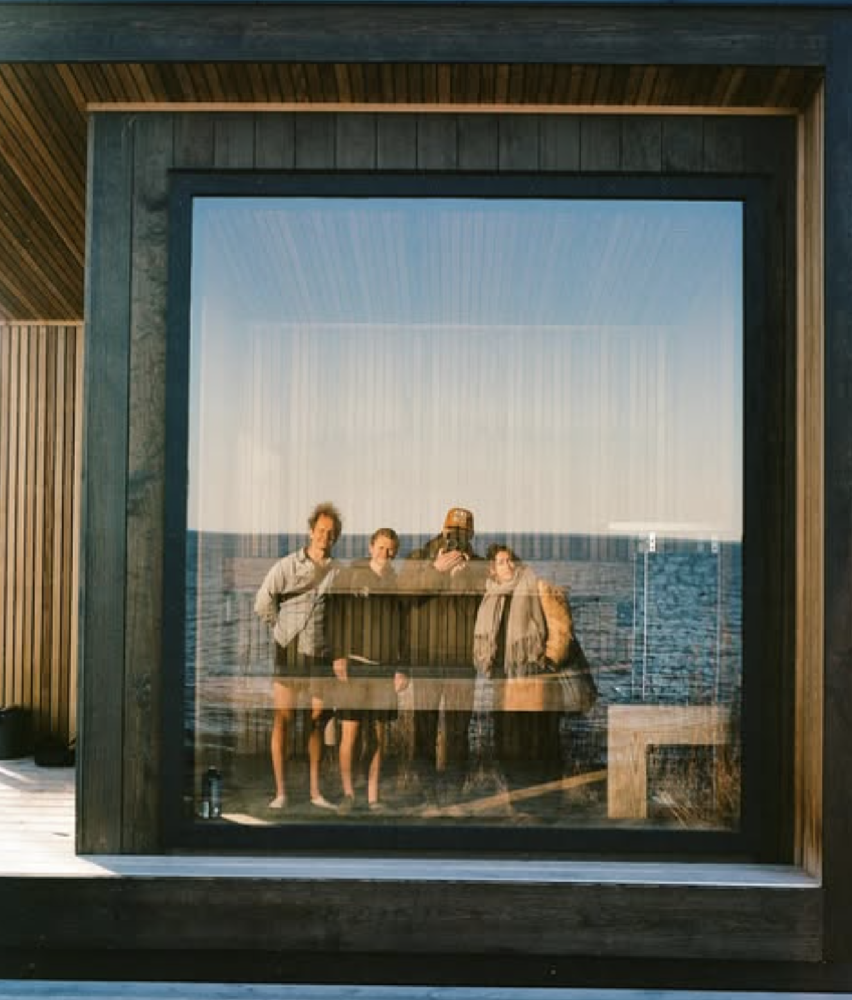

import BlogCTA from '@/components/blog/BlogCTA.astro';

## The Spark

Last winter, we sat in a wood-fired sauna by the Rivanna River in Charlottesville.

Inside the warmth of that sauna, surrounded by strangers with different stories and backgrounds, something shifted. We talked about everything and nothing—passion, purpose, the tension of modern life. No one had their phone. No one was trying to sell anything. For the first time in a long while, **we felt human again.**

That moment revealed just how *starved* we'd both become for real connection.

Wes had become a parent during COVID, watching his social world slowly thin. Julien had been working remotely while feeling increasingly unmoored from what matters. Both of us had been keeping up with everything the modern world demands of us—the news, the apps, the texts—but somewhere along the way, we'd stopped keeping up with ourselves. With the people in front of us. With the world right outside our door.

That day by the Rivanna, we remembered what it feels like to be **present—not productive**. To be **curious—not curated**. To be warm, quiet, and still enough to hear what the body and heart have been trying to say.

And we both knew: Richmond needed a place like this.

## Our Mission

**To create a tech-free sanctuary where Richmond can reconnect—with themselves, with each other, and with the present moment.**

We believe that true wellness isn't found in optimization or productivity. It's found in the simple, ancient practice of being present. Of feeling. Of breathing. Of sitting shoulder to shoulder with another human being and remembering that we're not alone.

Pyre exists to offer that space—a place where you don't have to *do* anything except *be*.

## Our Vision

**Richmond's first bathhouse in over a century—a beloved third space where diverse communities come together to heal, connect, and thrive.**

We envision a future where:
- **Connection is effortless**: Strangers become friends in the warmth of shared experience
- **Wellness is accessible**: Everyone—regardless of background, income, or identity—has access to practices that nurture body and soul
- **Community is tangible**: People bump up against those different from themselves and discover their shared humanity
- **Presence is celebrated**: We collectively resist the pull of digital distraction and reclaim our attention, our time, and our aliveness

## Our Values

### 1. Presence Over Productivity

In a world that constantly demands more—more efficiency, more output, more hustle—we believe in the radical act of simply being. At Pyre, there's no performance required. No agenda to advance. Just sensation, breath, and the courage to be still.

### 2. Connection Over Curation

We're living in an era of hyper-curated experiences, where algorithms decide who and what we encounter. Pyre is the opposite. Here, you'll find diversity—of culture, thought, and experience. Because healing doesn't happen in a vacuum. It happens when we sit beside someone whose story is different from ours and realize we're more alike than we knew.

### 3. Community Over Isolation

Both of us—Wes and Julien—came to this work from a place of profound disconnection. We were starved for real connection, and we know we're not alone.

Richmond—and cities everywhere—are full of people who feel the same way. Pyre is our answer: a place where community isn't something you schedule or optimize. It's something you *feel*.

### 4. Ancient Wisdom Meets Modern Need

Sweat bathing is one of humanity's oldest practices. [From Finnish saunas to Turkish hammams, from Native American sweat lodges to Korean jjimjilbangs](/blog/history-of-sweat-bathing), cultures across the globe have understood what we're only now rediscovering: that heat, cold, breath, and stillness are pathways to healing.

We honor those traditions while creating something that speaks to *this* moment—this city, this need, this community.

### 5. Accessibility and Inclusion

Pyre is for everyone. We're committed to creating a space where people of all backgrounds, bodies, identities, and income levels feel welcome and safe. This isn't just a nice-to-have—it's core to who we are.

Healing happens in community. And community means *all* of us.

## What This Practice Does for Us

For both of us, sauna and cold plunge have become non-negotiable anchors in our lives.

**Wes**: "After our experience in Charlottesville, I knew I'd found something I'd been missing my whole life. Sauna gives me permission to slow down, to feel, to remember what it's like to be present—not just as a founder or a father, but as a human being."

**Julien**: "In the sauna, I'm not solving problems or planning for the next thing. I'm just... here. And in that simplicity, I've found clarity I didn't know I needed. It's where I reconnect with my body, my breath, and the people sitting beside me."

This practice has taught us:
- **To listen to our bodies** instead of overriding their signals
- **To sit with discomfort** without needing to fix it
- **To value rest and recovery** as much as work and effort
- **To build relationships** that go beyond transactions or networking
- **To be vulnerable** and let ourselves be seen

## How We Want It to Affect People

Pyre is a place where you:
- **Remember how to feel**: Not intellectualize. Not analyze. Just *feel* the heat, the cold, the breath, the aliveness in your body.
- **Reconnect with others**: In a world that's increasingly fragmented, we want Pyre to be a place where real connection happens—organic, unforced, and human.
- **Come back to yourself**: Beneath the noise, the roles, the expectations—who are you? What do you need? What are you longing for? Pyre is a place to ask those questions and actually hear the answers.
- **Find your community**: Whether you come alone or with friends, we want you to leave feeling like you belong to something bigger than yourself.

## Why Richmond Needs This

Richmond is a city of contradictions. It's growing fast, yet many feel more isolated. It's culturally rich, yet fragmented. It's full of passionate, creative people who are hungry for something *real*—something that isn't transactional or performative.

We were both born and raised here. This city is in our bones. And we believe Richmond is ready for this.

Ready for a space that honors slowness in a fast world.Ready for a practice that values presence over productivity. Ready for a community that celebrates diversity and shared humanity.

**Pyre is our love letter to Richmond**—a sanctuary from the noise, a place to remember what it feels like to be human, and an invitation to build the kind of community we all desperately need.

---

**We can't wait to welcome you in.**

With love,
Wes & Julien

---

<BlogCTA />
