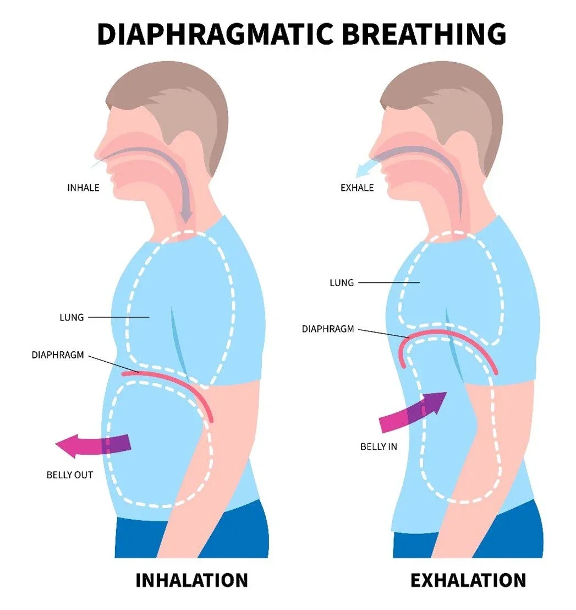

import BlogCTA from '@/components/blog/BlogCTA.astro';

In the quest for optimal health and well-being, we often focus on diet, exercise, and sleep. But there's another critical component that deserves attention: the vagus nerve. This remarkable cranial nerve serves as a communication superhighway between your brain and body, playing a vital role in everything from heart rate and digestion to mood regulation and immune function.

At Pyre in Richmond, VA, we've designed our social bathhouse experience around practices that naturally stimulate the vagus nerve-sauna bathing, cold plunging, and breathwork. Understanding how these modalities work together to activate your body's relaxation response can transform your approach to wellness and stress management.

## Understanding the Vagus Nerve

The vagus nerve is the longest and most complex of the twelve cranial nerves, extending from the brainstem down through the neck, chest, and abdomen. Its name comes from the Latin word "vagus," meaning "wandering," which aptly describes its extensive reach throughout the body.

### The Mind-Body Connection

This nerve is the primary component of the parasympathetic nervous system-your body's "rest and digest" mode. When activated, it counteracts the stress-induced "fight or flight" response, promoting:[^1]

- **Reduced heart rate and blood pressure**: Calming the cardiovascular system
- **Improved digestion**: Enhancing nutrient absorption and gut health
- **Decreased inflammation**: Regulating immune system responses
- **Enhanced mood**: Supporting neurotransmitter production
- **Better stress resilience**: Building capacity to handle life's challenges

High vagal tone-the measure of vagus nerve activity-is associated with better physical health, emotional regulation, and social connection. Low vagal tone, conversely, has been linked to inflammation, anxiety, depression, and various chronic health conditions.[^2]

## Sauna: Heating Up Vagal Tone

The ancient practice of sauna bathing does far more than make you sweat-it's a powerful tool for vagus nerve stimulation and overall nervous system regulation.

### How Heat Activates the Vagus Nerve

When you sit in a sauna, several mechanisms work together to stimulate vagal activity:[^3][^4]

**Controlled Heat Stress**: The warm environment creates a controlled stressor that triggers your body's adaptive responses. This paradoxically activates the parasympathetic nervous system, promoting relaxation even as your heart rate increases.

**Improved Heart Rate Variability (HRV)**: Regular sauna use has been shown to improve HRV, a key indicator of vagal tone. Higher HRV means your vagus nerve is better able to regulate your heart rate in response to different situations.[^3]

**Endorphin Release**: The heat stimulates the release of endorphins and other beneficial neurochemicals that interact with vagal pathways, enhancing mood and reducing pain perception.

**Deep Relaxation**: The quiet, warm environment naturally encourages slower, deeper breathing-a direct pathway to vagal activation that we'll explore more in the breathwork section.

## Cold Plunge: The Icy Path to Resilience

While heat soothes, cold invigorates-and both pathways lead to enhanced vagal function. Cold water immersion is one of the most powerful natural methods for directly stimulating the vagus nerve.

### The Cold Shock Response

When you plunge into cold water, an immediate cascade of physiological changes occurs:[^5][^6]

**Direct Vagal Stimulation**: The cold shock activates the diving reflex, an ancient mammalian response that immediately stimulates the vagus nerve. This causes an instant decrease in heart rate (despite the initial adrenaline surge) and redirects blood flow to vital organs.

**Norepinephrine Surge**: Cold exposure triggers a significant release of norepinephrine, a neurotransmitter that enhances focus, mood, and attention. The vagus nerve helps regulate this response, building resilience with each exposure.[^5]

**Improved Vagal Tone**: Regular cold exposure has been shown to increase baseline vagal tone over time, meaning your nervous system becomes more adaptable and resilient to stress.[^6]

**Inflammation Reduction**: The vagus nerve plays a crucial role in the "inflammatory reflex"-the body's ability to regulate immune responses. Cold plunging activates this pathway, helping reduce chronic inflammation.[^7]

### Building Mental Resilience

Perhaps most importantly, the practice of voluntarily entering cold water teaches your nervous system that you can remain calm in uncomfortable situations. This stress inoculation, mediated through vagal pathways, translates to better emotional regulation in daily life.

## Breathwork: The Direct Access Point

Of all the ways to stimulate the vagus nerve, conscious breathing is the most accessible and immediate. The vagus nerve has extensive connections to the muscles involved in breathing, making breath control a powerful tool for nervous system regulation.

### Breathing Techniques for Vagal Activation

Several breathing patterns have been shown to enhance vagal tone:[^8][^9]

**Slow, Deep Breathing**: Breathing at a rate of 5-6 breaths per minute (compared to the typical 12-20) maximally stimulates the vagus nerve. This can be achieved through box breathing (4 counts in, 4 hold, 4 out, 4 hold) or simply extending each breath cycle.

**Extended Exhales**: Making your exhale longer than your inhale (such as breathing in for 4 counts and out for 6-8 counts) increases vagal activity and promotes the relaxation response.[^8]

**Diaphragmatic Breathing**: Breathing deeply into the belly rather than the chest engages the vagus nerve more effectively, triggering the parasympathetic response.

**Coherent Breathing**: Breathing at a specific rhythm that synchronizes heart rate variability with breath creates optimal vagal stimulation and has been used therapeutically for anxiety and depression.[^9]

### Breathwork in the Sauna and Cold Plunge

The real magic happens when you combine breathwork with heat and cold exposure:

**In the Sauna**: The quiet, warm environment is ideal for practicing slow, deep breathing. This amplifies the vagal benefits of heat exposure while promoting meditation and mental clarity.

**Before the Cold Plunge**: Controlled breathing helps prepare your nervous system for the cold shock, allowing you to enter the water with intention rather than panic.

**During the Cold Plunge**: Maintaining slow, deliberate breathing while immersed in cold water trains your vagus nerve to remain calm under stress-a skill that extends far beyond the ice bath.

**After the Plunge**: Continuing controlled breathing as you warm up helps regulate the transition between sympathetic (cold shock) and parasympathetic (recovery) states.

## The Synergistic Effect: Contrast Therapy

The true power emerges when we combine these practices. Alternating between sauna heat and cold plunges creates what we call contrast therapy-a practice that maximally stimulates vagal function through repeated, controlled stress and recovery cycles.

### The Vagal Workout

Think of contrast therapy as interval training for your nervous system:[^10]

1. **Heat Exposure**: Activates parasympathetic response, improves HRV, promotes relaxation
2. **Controlled Breathing**: Amplifies vagal tone, maintains calm during stress
3. **Cold Exposure**: Triggers diving reflex, stimulates direct vagal activation, builds resilience
4. **Recovery**: Allows nervous system integration, strengthens adaptive capacity

Each cycle strengthens your vagal tone, making your nervous system more flexible and resilient. Over time, this translates to better stress management, improved emotional regulation, and enhanced physical health.

## The Richmond Wellness Revolution

At Pyre, we've created Richmond's premier destination for vagus nerve optimization through time-honored wellness practices. Our social bathhouse brings together the essential elements-traditional saunas, therapeutic cold plunges, and a community that values intentional breathing and presence.

### Why This Matters for Richmond

In a city experiencing rapid growth and change, maintaining nervous system health is more important than ever. The chronic stress of modern life keeps many of us stuck in sympathetic overdrive-high cortisol, poor sleep, digestive issues, and emotional fatigue.

Our approach offers a natural, science-backed path to nervous system restoration. Whether you're an athlete seeking performance enhancement, a professional managing work stress, or someone on a healing journey, regular vagal stimulation through sauna, cold plunge, and breathwork can be transformative.

## Building Your Vagal Wellness Practice

If you're new to these practices, here's how to begin:

### Start with Breathing
- Practice 5 minutes of slow breathing each morning
- Focus on extending your exhales
- Use breath awareness during stressful moments throughout the day

### Add Regular Sauna Sessions
- Begin with 10-15 minute sessions, 2-3 times per week
- Practice deep, slow breathing while in the sauna
- Notice the relaxation response as it develops
- Gradually increase duration as comfort builds

### Introduce Cold Exposure Gradually
- Start with cold showers (30 seconds after your regular shower)
- Focus on breathing through the discomfort
- Progress to cold plunges (start with 1-2 minutes)
- Always have support nearby when beginning

### Combine for Maximum Benefit
- Alternate between sauna and cold (2-3 cycles)
- Maintain conscious breathing throughout
- End with gentle warming and hydration
- Aim for 3-4 sessions per week for optimal results

## The Science of Community and Connection

There's one more crucial element: the social aspect of bathhouse culture. Research shows that positive social connections themselves stimulate the vagus nerve and increase vagal tone.[^11] Sharing these experiences with others amplifies the benefits.

At Pyre, we've intentionally created spaces that encourage connection-social sauna sessions where conversation flows naturally, guided breathwork experiences that build community, and a welcoming environment where everyone is on their own wellness journey together.

## Safety Considerations

While these practices offer tremendous benefits, it's important to approach them wisely:

- Consult with a healthcare provider if you have cardiovascular conditions, pregnancy, or other medical concerns
- Never cold plunge alone, especially when beginning
- Stay hydrated before and after heat exposure
- Listen to your body and exit if you feel dizzy or uncomfortable
- Start slowly and build gradually-your nervous system needs time to adapt

## The Path Forward

The vagus nerve offers a powerful lens for understanding how simple, natural practices can profoundly impact our health. Sauna bathing, cold plunging, and breathwork aren't just wellness trends-they're evidence-based tools for nervous system optimization that humans have used for thousands of years.

In Richmond, we're rediscovering these ancient practices and making them accessible to everyone seeking better physical health, emotional balance, and genuine community connection.

Your vagus nerve is waiting to be activated. The heat is ready. The cold is calling. Your breath is the bridge between them.

Join us at Pyre, and discover what it feels like when your nervous system finds its natural rhythm again.

---

*Note: The practices described in this article are generally safe for healthy individuals but may not be appropriate for everyone. Consult with a healthcare provider before beginning any new wellness practice, especially if you have pre-existing medical conditions.*

---
<BlogCTA />
---

## References

[^1]: Breit, S., Kupferberg, A., Rogler, G., & Hasler, G. (2018). [Vagus Nerve as Modulator of the Brain-Gut Axis in Psychiatric and Inflammatory Disorders.](https://www.frontiersin.org/articles/10.3389/fpsyt.2018.00044/full) *Frontiers in Psychiatry*, 9, 44.
[^2]: Thayer, J. F., & Lane, R. D. (2007). [The role of vagal function in the risk for cardiovascular disease and mortality.](https://www.sciencedirect.com/science/article/abs/pii/S0006322306012791) *Biological Psychiatry*, 74(4), 224-242.
[^3]: Laukkanen, T., Kunutsor, S., Kauhanen, J., & Laukkanen, J. A. (2017). [Sauna bathing is inversely associated with dementia and Alzheimer's disease in middle-aged Finnish men.](https://academic.oup.com/ageing/article/46/2/245/2654230) *Age and Ageing*, 46(2), 245-249.
[^4]: Hussain, J., & Cohen, M. (2018). [Clinical Effects of Regular Dry Sauna Bathing: A Systematic Review.](https://www.hindawi.com/journals/ecam/2018/1857413/) *Evidence-Based Complementary and Alternative Medicine*, 2018.
[^5]: Buijze, G. A., Sierevelt, I. N., van der Heijden, B. C., Dijkgraaf, M. G., & Frings-Dresen, M. H. (2016). [The Effect of Cold Showering on Health and Work: A Randomized Controlled Trial.](https://journals.plos.org/plosone/article?id=10.1371/journal.pone.0161749) *PLOS ONE*, 11(9), e0161749.
[^6]: Shevchuk, N. A. (2008). [Adapted cold shower as a potential treatment for depression.](https://pubmed.ncbi.nlm.nih.gov/18050095/) *Medical Hypotheses*, 70(5), 995-1001.
[^7]: Pavlov, V. A., & Tracey, K. J. (2012). [The vagus nerve and the inflammatory reflex-linking immunity and metabolism.](https://www.nature.com/articles/nrendo.2012.189) *Nature Reviews Endocrinology*, 8(12), 743-754.
[^8]: Russo, M. A., Santarelli, D. M., & O'Rourke, D. (2017). [The physiological effects of slow breathing in the healthy human.](https://breathe.ersjournals.com/content/13/4/298) *Breathe*, 13(4), 298-309.
[^9]: Lehrer, P., Kaur, K., Sharma, A., Shah, K., Huseby, R., Bhavsar, J., & Zhang, Y. (2020). [Heart Rate Variability Biofeedback Improves Emotional and Physical Health and Performance: A Systematic Review and Meta Analysis.](https://link.springer.com/article/10.1007/s10484-020-09466-z) *Applied Psychophysiology and Biofeedback*, 45(3), 109-129.
[^10]: Mooventhan, A., & Nivethitha, L. (2014). [Scientific evidence-based effects of hydrotherapy on various systems of the body.](https://www.ncbi.nlm.nih.gov/pmc/articles/PMC4049052/) *North American Journal of Medical Sciences*, 6(5), 199-209.
[^11]: Kok, B. E., & Fredrickson, B. L. (2010). [Upward spirals of the heart: Autonomic flexibility, as indexed by vagal tone, reciprocally and prospectively predicts positive emotions and social connectedness.](https://www.ncbi.nlm.nih.gov/pmc/articles/PMC2998829/) *Biological Psychology*, 85(3), 432-436.
